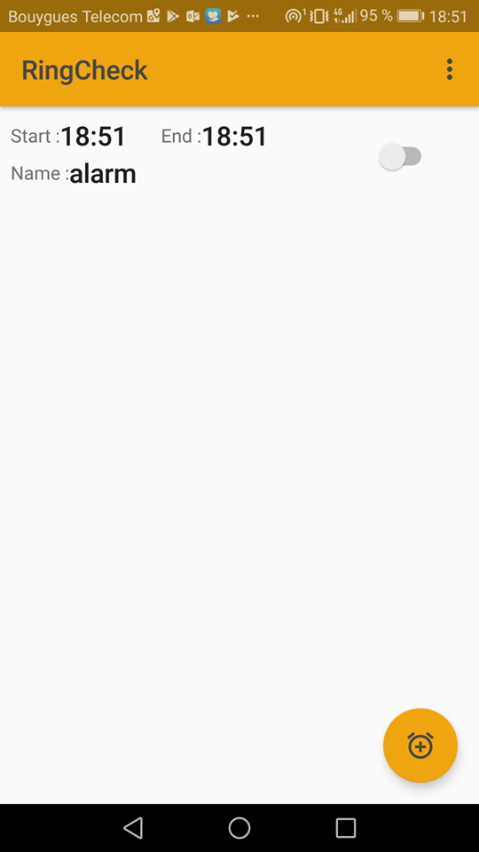
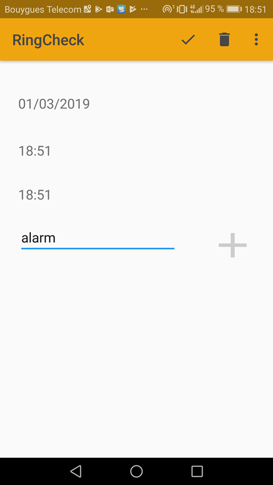
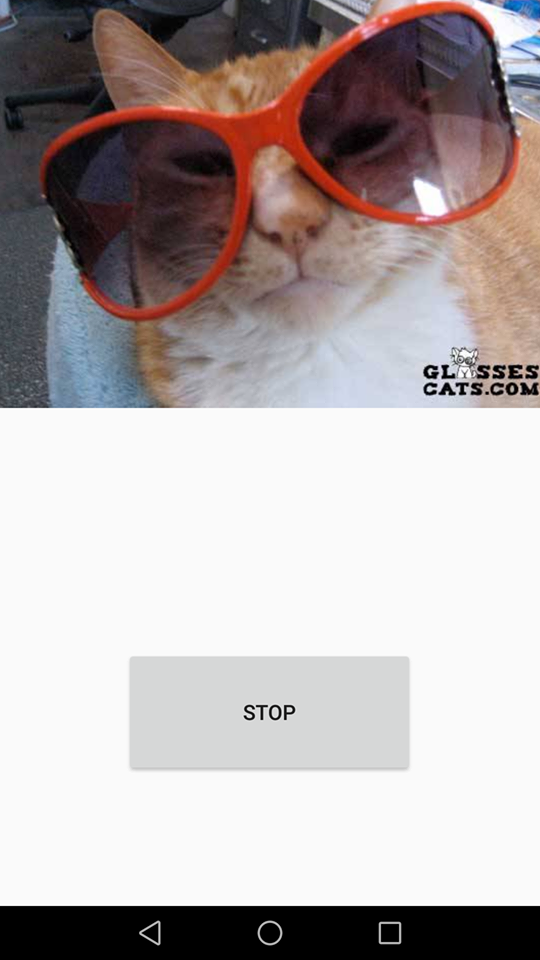

# RingCheck Android Alarme application

### Dépendance :
- androidx
- glide
- retrofit2
- retrofit2:converter-gson 

### AndroidStudio
Version 3.3

### Prérequis :
un smartphone android avec de préférence un sdk supérieur ou égal à "LOLIPOP" (24)

### Description
Cette application est un réveil. On peut ajouter autant de réveils que l'on veut. Elle se démarque par son écran d'alarme qui affiche une image de chat différente à chaque réveil.

### Utilisation

On ajoute les alarmes avec le bouton "plus" en bas à droite, on sélectionne une date, une heure de réveil et une heure de départ( pas encore implémentée, donc fictive).
On valide l'alarme a l'aide des boutons supérieurs dans le menu. Puis on arrive sur la page pour activer les alarmes. Une fois qu'une alarme s'est activée, elle est détruite.

### Screen

### TODO
la gestion de la check liste pour l'heure de départ n'est pas encore implémenter.